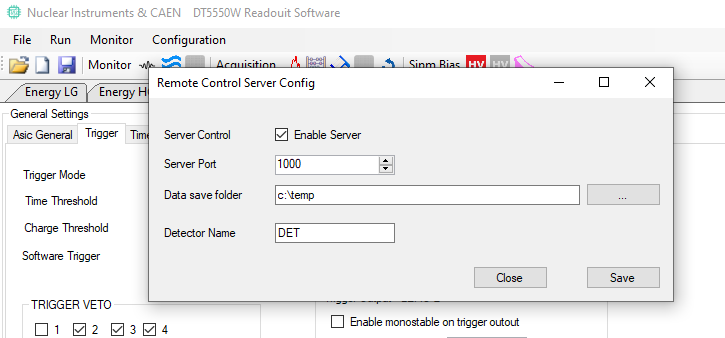

# Remote control protocol for DT5550W

The DT5550W readout software ( download binaries from http://www.caen.it or get source code from Nuclear Instruments github repo https://github.com/NuclearInstruments/DT5550W) can be remote controlled by a client using a simple socket based tcp-ip protocol

This repo contains a client example written in python that start/stop a list of DT5550W clients.

Under configuration menu in the software enable the server


# Configuration
Enter the list of the client to be controlled
```
LIST_OF_CLIENT = [
    {
        "name":"DET_1",
        "ip":"127.0.0.1",
        "port":1000,
        "enabled": True
    },
    {
        "name":"DET_2",
        "ip":"10.128.0.1",
        "port":151,
        "enabled": False
    }
]
```

In the main function define the following variable

```
    CURRENT_RUN_NUMBER = 15
    CURRENT_RUN_TYPE = 1
    T_RUN_S = 10
```
Where the run type is a flag that will be reported in the filename as well as the run number and the unix start time.
The `T_RUN_S` varaible define the time duration of the run in seconds. The run will be automatically stopped after `T_RUN_S`

# Protocol
User can develop a client in any programming language that support tcp raw socket.
The protocol support only two command: START and STOP.
The configuration is stored in the DT5550W application and the software must be configured in the correct way before starting the run.
Each command is compose by 3 phase:
 - open connection
 - send command
 - close connection

after each command is mandatory to close the connection

**START COMMAND**

| 0xFF | 0x80 | 0x00 | 0x08 | RN1 | RN0 | RT1 | RT0 | 0xEE | 0x00 | 0x00 | 0x01 | T3 | T2 | T1 | T0 |
|------|------|------|------|-----|-----|-----|-----|------|------|------|------|----|----|----|----|

**STOP COMMAND**

| 0xFF | 0x80 | 0x00 | 0x08 | RN1 | RN0 | RT1 | RT0 | 0xEE | 0x00 | 0x00 | 0x01 | T3 | T2 | T1 | T0 |
|------|------|------|------|-----|-----|-----|-----|------|------|------|------|----|----|----|----|

RN1: Run number MSB byte [15..8]
RN0: Run number LSB byte [7..0]

RT1: Run type MSB byte [15..8]
RT0: Run type LSB byte [7..0]

T3: Run type MSB byte [31..24]
T2: Run type          [23..16]
T1: Run type          [15..8]
T0: Run type LSB byte [7..0]

